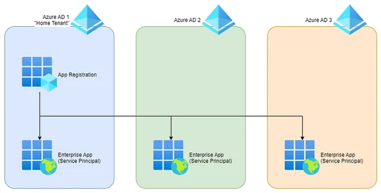

# PosInformatique.Azure.Identity.AppRegistrationSecretWatcher

Monitors Azure App Registration secrets expiration and emails a periodic report. This repository ships an Azure Functions
executable with the monitoring logic already packaged.

## Features
- Monitor secrets across one or multiple Entra ID tenants (Entra ID, Azure B2C, Entra External ID,...).
- Send a consolidated report at a customizable interval (cron-based).
- Simple deployment to Azure Functions (pre-packaged, no build/CD required).
- Runs on Azure Functions Consumption plan (**NO COST!!!**).

## How it works
- Enumerates App Registrations and checks client secrets and certificates nearing expiration.
- Sends a summary report by email using Microsoft Graph.
- Can run with Managed Identity (single-tenant) or a dedicated App Registration (multi-tenant).

## Identity and tenant models

### Single-tenant
- Use the Azure Function with system or user assigned managed identity.
- Monitors only the current tenant.
- No client ID/secret needed.

### Multi-tenant

- Create an App Registration in one *Home Tenant* tenant with a client secret.
- Register this application in each additional tenant (*Azure AD 2*, *Azure AD 3*,...) and obtain admin consent.
- Configure this application credentials in the Function App to query all target tenants.

## Requirements and configuration

The **AppRegistrationSecretWatcher** requires the following Microsoft Graph permissions:

For each tenant to watch:
- `Application.Read.All`
- `Organization.Read.All`

To send the e-mail using Graph API:
- `Mail.Send`

### Configuration

- `APP_SECRET_WATCHER_CLIENT_ID`:
  Client ID of the App Registration used to query secrets across tenants. If omitted, the Function managed identity is used (single-tenant only).
- `APP_SECRET_WATCHER_CLIENT_SECRET`:
  Client secret of the App Registration. Not required if using managed identity or certificate auth.
- `APP_SECRET_WATCHER_CULTURE`:
  Culture name used to format the dates and times for the reports. (`en-US` will be used if not specified).
- `APP_SECRET_WATCHER_EXPIRATION_THRESHOLD`:
  Time span threshold to raise warnings before secret expiration. Example: `30.00:00:00` for 30 days.
- `APP_SECRET_WATCHER_FREQUENCY`:
  Cron expression for the timer trigger (report frequency, daily minimum recommended). Example: `0 0 6 * * *` (every day at 06:00 UTC).
- `APP_SECRET_WATCHER_RECIPIENTS_EMAIL`:
  Semicolon-separated email recipients for the report. Example: `ops@contoso.com;security@contoso.com`.
- `APP_SECRET_WATCHER_SENDER_EMAIL`:
  Sender email used by Graph. Must exist in Entra ID (user or shared mailbox).
- `APP_SECRET_WATCHER_TENANT_IDS`:
  Semicolon-separated list of tenant IDs to monitor. Example: `11111111-1111-1111-1111-111111111111;22222222-2222-2222-2222-222222222222`.

> If the application have to watch only a single tenant, use a managed identity. In this case, you don't need to
define the `APP_SECRET_WATCHER_CLIENT_ID` and `APP_SECRET_WATCHER_CLIENT_SECRET` environment variables.

### Email Sending
- By default, the Azure Function uses Microsoft Graph with the Function managed identity.
- If you must use a specific service principal instead, set the following environment variable:
  - `AZURE_CLIENT_ID`: The application client id to use to send the e-mail with the Graph API (and have the `Mail.Send` application permission).
  - `AZURE_CLIENT_SECRET`: The secret of the application which will be use to send the e-mail with the Graph API.
  - `AZURE_TENANT_ID`: The tenant ID where the application to send the e-mail with Graph API is located.

## Deployment

### 1) Azure Function App 
- Create an Azure Function App (Isolated v4, .NET 9), use a *Consumption plan* if you want to have no cost.
- Enable managed identity if you plan to run single-tenant and/or use managed identity to send the e-mail with Microsoft Graph API.

### 2) Run from Package (no CD needed)
- Set the `WEBSITE_RUN_FROM_PACKAGE` app setting to the release package URL. Example:
  - `https://github.com/PosInformatique/PosInformatique.Azure.Identity.AppRegistrationSecretWatcher/releases/download/v1.0.0/PosInformatique.Azure.Identity.AppRegistrationSecretWatcher.Functions.net9.0.zip`
- You can choose the AppRegistrationSecretWatcher version and the .NET target by selecting the appropriate asset in Releases.

This approach lets Azure manage the package directly; you only update the `WEBSITE_RUN_FROM_PACKAGE` URL to upgrade.

### 3) Configure App Settings
- Add all environment variables listed in *Requirements and configuration* section.

### Scheduling Examples

- Daily at 06:00 UTC:
  - `APP_SECRET_WATCHER_FREQUENCY = 0 0 6 * * *`
- Every 12 hours:
  - `APP_SECRET_WATCHER_FREQUENCY = 0 0 */12 * * *`

### Permissions Summary

Grant the following Microsoft Graph application permissions to the identity used for directory reads:
- `Application.Read.All`
- `Organization.Read.All`

Then grant Admin Consent in each monitored tenant.

For email sending, ensure the sender exists and the identity used managed identity or service principal is allowed
to send mail via Graph withb the `Mail.Send` application permission.

## Notes and Best Practices

- Use Managed Identity for simplicity when monitoring only the current tenant.
- Keep `APP_SECRET_WATCHER_EXPIRATION_THRESHOLD` aligned with your rotation policy (e.g., 30–60 days).
- Ensure recipients are a monitored distribution list or shared mailbox to avoid missed alerts.

## Compatibility
- .NET: 9.0
- Azure Functions: Isolated v4
